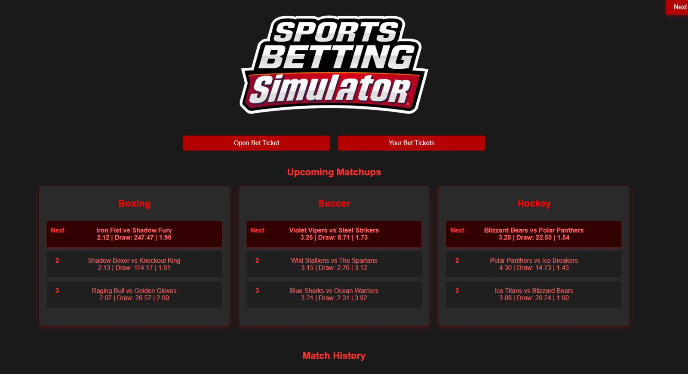

# SportsBetSim - A Betting Game Simulator (Work in Progress)

SportsBetSim is a browser-based **sports betting simulator game** built with **React**. Currently it generates random sports teams, calculates match results, and allows users to place bets on upcoming games. This project is currently in development, and features are still being added and refined.

## Features

### Core Functionality
- **Random Team Generation**: Generates unique stats for 20 teams across three sports.
- **Matchup Scheduling**: Creates schedules for upcoming and past matchups. Past matchups are calculated based on weighted randomization with team stat comparisons.
- **Team Profiles**: Lists of teams for each sport, including a "team profile" view that displays a team’s match history and statistics.
- **Odds Calculation**: Calculates odds for each upcoming matchup based on match history and team stats.
- **Daily Match Processing**: Upon moving to the "Next Day," match results are calculated, matches are archived to history, and team stats are updated. Odds are recalculated for future matchups.

### Betting System
- **Betting Grid and Odds Calculation**: Allows users to view upcoming matches and select odds for betting. 
- **Bet Ticket System**: Tracks submitted bet tickets and calculates potential winnings. A Ticket Manager tracks all finalized tickets.

### Story and Loan/Rent System (In progress)
- **The Backstory**: Start with overdue rent and a $2,000 mafia loan, navigating a high-stakes world of sports betting to survive.  
- **Loan System**: Manage weekly loan repayments with increasing interest or risk losing it all.  
- **Rent System**: Pay weekly rent to avoid eviction, creating constant pressure to win bets.

## Technologies Used

### Frontend
- **React**: For building the user interface.
- **react-router-dom**: For routing and navigation.

### Backend
- **Node.js**: Handles server-side logic.
- **Express**: Powers the RESTful API.

### Deployment
- **Dockerized Setup**: SportsBetSim uses **Docker** to streamline deployment, with two containers:
  - **Frontend Container**: Serves the React application.
  - **Backend Container**: Runs the Node.js/Express server.
- **Reverse Proxy (Nginx)**: Nginx is used to route between the frontend and backend containers.

## Coming Soon
The next updates will focus on **completing the loan and rent system** with tracking and win/lose conditions.

> ⚠️ **Note**: This project is a work in progress, and more updates are to come. The current structure and functionality are subject to change.
